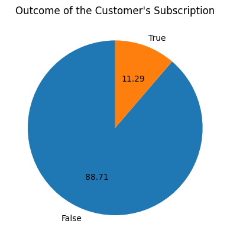
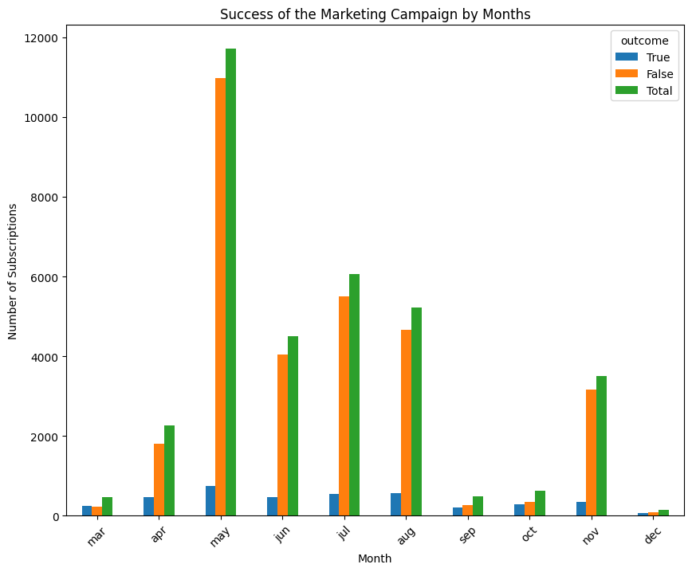
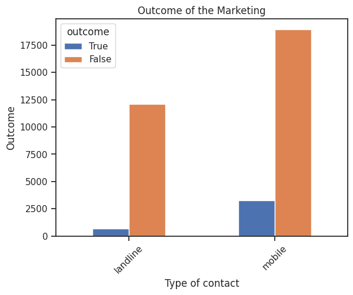
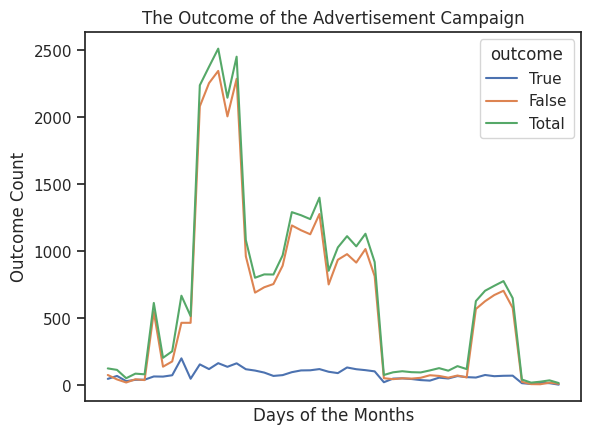
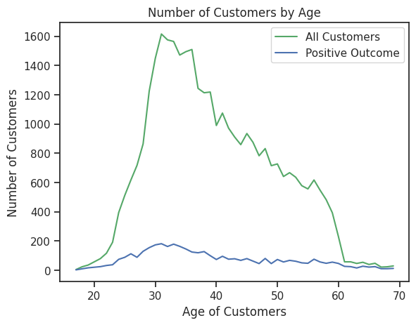
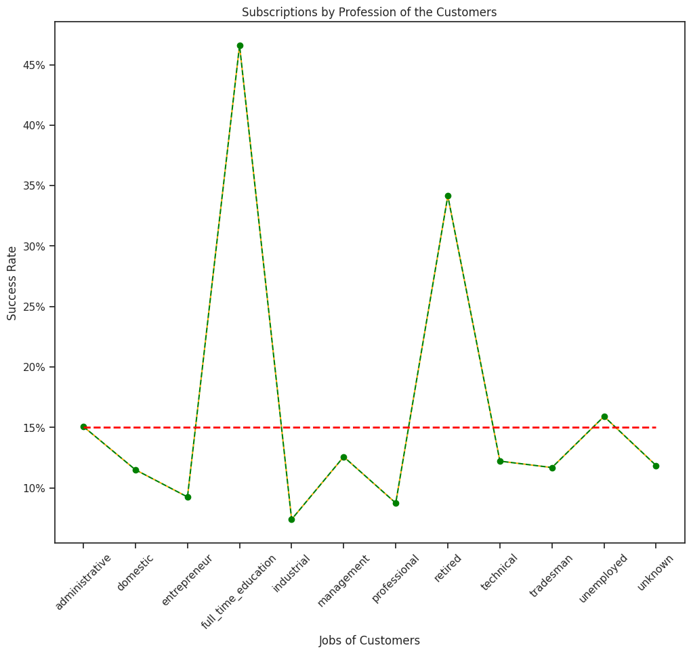
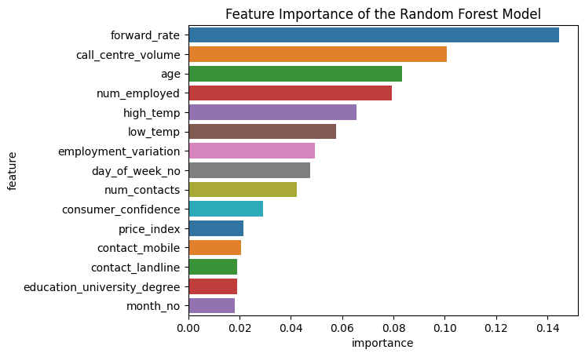
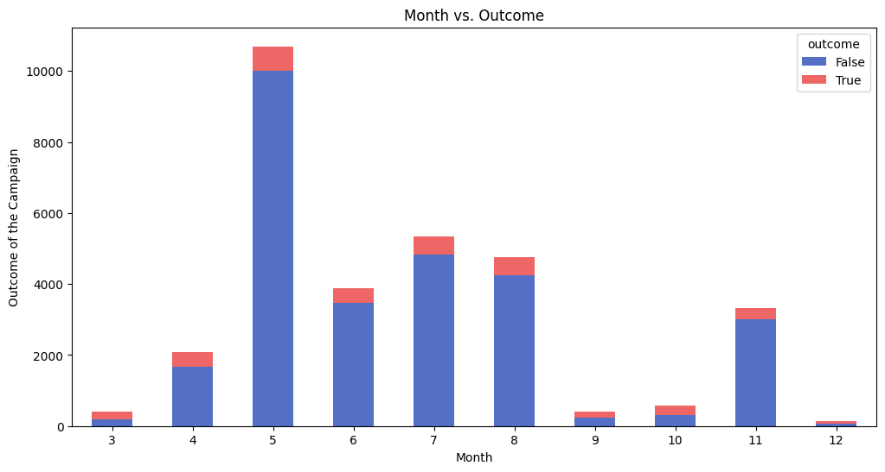
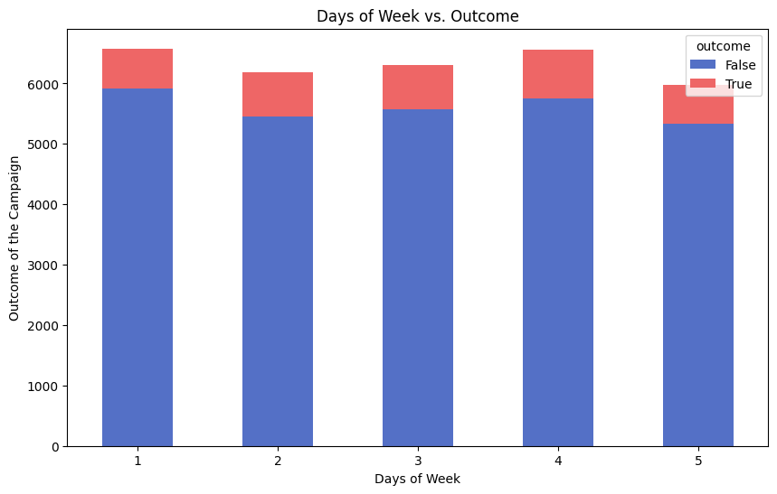

# LittleBank — Data Science Case Study

[](https://www.python.org/)
[](https://jupyter.org/)
[](https://scikit-learn.org/)
[](https://xgboost.readthedocs.io/)
[](LICENSE)
[](#contributing)
[](https://github.com/krasvachev/Data-Science-Case-Study)
[](https://github.com/krasvachev/Data-Science-Case-Study)

> **A complete, interview-ready Data Science case study for Big Four (Deloitte, EY, KPMG, PwC) technical interviews — featuring an exhaustive EDA, a full ML pipeline, business-focused recommendations, and a detailed interview preparation guide.**

---

## Introduction

A Data Scientist or Machine Learning Engineer role at one of the Big Four (Deloitte, EY, KPMG, PwC) is a great opportunity that should not be missed. The Big Four companies generate $219 billion in revenue, with worldwide offices and more than 1.5 million employees. This makes them the largest professional service and accounting companies in the world. Being a part of them means you could work on a variety of projects across a wide range of fields, and build broad experience across many topics — especially in the early stages of a career. However, to be a part of the Big Four, first you have to pass the interview process. And the case study task... I mean the technical case study.

What is a case study? That is the question I asked myself when I first heard that I had to tackle such a problem. Typically, there are between 3 and 5 interviews when applying to a Big Four firm. The case study is a business task that the candidate has to solve within a fixed time. For the tech interview, the company often provides a real-world dataset. The goal is to perform Exploratory Data Analysis (EDA), apply Machine Learning (ML) models, and answer specific business questions connected to the task. Usually, the time to solve all three tasks is 3 hours.

When I was doing my preparation, I could not find a case study example for Data Scientists or ML Engineers. This is the first reason for creating this repository — to provide job seekers with an exercise to practise on. There is also a second reason: I failed to pass the data science case study. However, I decided to solve the task outstandingly with a solution that successfully passes the case study interview. And last but not least, the goal of the repo is not just helping me, but also helping **you** land that dream job.

The repo provides an exhaustive solution to a Data Science case study task given during a Big Four technical interview. It also provides guidance on how to prepare for the interviews. The main focus is put on how to tackle the case study. There are also hints on how to use LLM models to help you efficiently during your interview preparation.

The solutions are not limited to the Big Four accounting companies. They can be helpful for other accounting and professional service firms as well. In addition, the solutions apply the most common ML and Data Science practices. That is why they can be a great resource for any ML Engineer or Data Scientist preparing for a tech interview.

---

## Table of Contents

1. [Repository Structure](#repository-structure)
2. [The Task](#the-task)
3. [Dataset](#dataset)
4. [Brief and Detailed Solutions](#brief-and-detailed-solutions)
5. [Structure of the Notebooks](#structure-of-the-notebooks)
6. [Solutions](#solutions)
   - [Task 1 — Exploratory Data Analysis](#task-1--exploratory-data-analysis-eda)
   - [Task 2 — Machine Learning](#task-2--machine-learning)
7. [Models and Accuracy](#models-and-accuracy)
8. [Conclusion and Key Insights](#conclusion-and-key-insights)
9. [How to Tackle the Interview](#how-to-tackle-the-interview)
10. [Python Scripts](#python-scripts)
11. [Requirements](#requirements)
12. [Contributing](#contributing)
13. [License](#license)

---

## Repository Structure

```
Data-Science-Case-Study/
│
├── LittleBank_Case_Study.ipynb              # Exhaustive EDA solution (Task 1)
├── LittleBank_Case_Study_ML.ipynb           # Exhaustive ML solution (Task 2)
├── littlebank_case_study.py                 # Script equivalent of the EDA notebook
├── littlebank_case_study_ml.py              # Script equivalent of the ML notebook
│
├── interview_solutions/
│   ├── task_1_eda/
│   │   ├── LittleBank_Case_Study_Concise_Solution.ipynb   # Concise EDA (interview use)
│   │   └── littlebank_case_study_concise_solution.py
│   └── task_2_machine_learning/
│       ├── LittleBank_Case_Study_ML_Concise_Solution.ipynb # Concise ML (interview use)
│       └── littlebank_case_study_ml_concise_solution.py
│
├── data/
│   └── LittleBank_Case_Study.csv            # Source dataset (35,000 records)
│
├── models/
│   └── model_decision_tree.pkl              # Saved Decision Tree model
│
├── images/
│   ├── task_1_figures/                       # EDA visualisations
│   └── task_2_figures/                       # ML visualisations
│
├── save/                                     # Preprocessed data (parquet, gitignored)
├── requirements.txt
├── LICENSE
└── README.md
```

| Folder / File | Purpose |
|---------------|---------|
| `LittleBank_Case_Study.ipynb` | The **detailed** EDA notebook — every section ends with a written business insight. |
| `LittleBank_Case_Study_ML.ipynb` | The **detailed** ML notebook — baselines, regularised models, tree models, XGBoost, and feature importance. |
| `interview_solutions/` | **Concise** versions of both notebooks, optimised for the 3-hour time limit. |
| `data/` | The source CSV provided by the client. |
| `models/` | Serialised model artefacts. |
| `images/` | All plots generated during the analysis, split by task. |
| `save/` | Preprocessed train/test parquet files (not tracked in git). |

---

## The Task

### Customer Analytics Case Study — Cross-sell Opportunities for LittleBank

> **Client:** LittleBank — a retail bank providing deposit accounts, loans, and savings products.
>
> **Problem:** The head of loan sales has noticed a recent **drop in subscriptions of the "classic savings account"** product, despite consistent telemarketing efforts offering the account to customers. He has turned to our company for advice on how to improve sales of this product.

LittleBank has shared a data file (`LittleBank_Case_Study.csv`) containing historical telemarketing-campaign records. The file includes:

- (i) Attributes of customer contacts when a classic savings product was offered.
- (ii) Details of any previous campaigns where a similar product had been offered.
- (iii) Customer attributes.
- (iv) Macroeconomic and environmental factors at the time each contact was made.
- (v) An indicator variable showing whether or not the client bought the product.

Since LittleBank has not yet used advanced analytics in its sales and marketing activities, the candidate must come prepared to **describe every algorithm employed and the approach taken** in plain, non-technical language.

### Business Questions

| # | Task | Type |
|---|------|------|
| **1** | What steps would you take to **understand and clean this data**? Perform **Exploratory Data Analysis (EDA)**. | Data Analysis |
| **2** | Produce **feature-importance estimates** from a trained predictive model. The target column is `outcome` — use **only the numerical columns**. Describe how you would explain the technique(s) to the head of loan sales. | Machine Learning |
| **3** | The table below demonstrates the **coefficients produced from a GLM ElasticNet** on the dataset to predict `outcome`. **Interpret** the table and put together **three recommendations** for the client in the form of one or two PowerPoint slides. | Business Strategy |

> **Time limit:** 3 hours for all three tasks combined.

### GLM ElasticNet Coefficients Provided by the Client

The third task provides a ready-made GLM ElasticNet (binomial) coefficient table. Interpreting it is a core part of the exercise.

| Variable | Coefficient | | Variable | Coefficient |
|----------|:-----------:|-|----------|:-----------:|
| `outcome_previous.success` | **+0.2101** | | `default.unknown` | −0.0181 |
| `month.mar` | +0.0830 | | `job.industrial` | −0.0195 |
| `days_since_previous` | +0.0453 | | `num_contacts` | −0.0263 |
| `contact.mobile` | +0.0366 | | `month.nov` | −0.0279 |
| `job.retired` | +0.0336 | | `contact.landline` | −0.0375 |
| `consumer_confidence` | +0.0331 | | `day_of_week.mon` | −0.0444 |
| `job.full_time_education` | +0.0203 | | `forward_rate` | −0.0477 |
| `default.no` | +0.0194 | | `outcome_previous.failure` | −0.0652 |
| `month.jul` | +0.0106 | | `employment_variation` | −0.1579 |
| `low_temp` | +0.0091 | | `month.may` | **−0.2845** |
| | | | `num_employed` | **−0.5581** |
| | | | *(Intercept)* | −2.4090 |

> *Notes: all categorical variables were one-hot encoded, all variables were centred and scaled, zero-coefficient variables excluded, and the GLM uses the **binomial** distribution.*

---

## Dataset

| Attribute | Value |
|-----------|-------|
| **File** | `data/LittleBank_Case_Study.csv` |
| **Rows** | 35,000 |
| **Columns** | 24 (12 numerical, 11 categorical, 1 target) |
| **Target** | `outcome` — TRUE / FALSE |
| **Positive class rate** | **11.29 %** (3,952 subscribers vs. 31,048 non-subscribers) |
| **Imbalance** | Severe — requires resampling or cost-sensitive training |

### Feature Descriptions

| Column | Description |
|--------|-------------|
| `month` | Month of latest contact |
| `day_of_week` | Day of latest contact |
| `contact` | Type of communication used (mobile / landline) |
| `num_contacts` | Number of contacts during this telemarketing campaign |
| `days_since_previous` | Days since contact in previous campaign (`-1` if not contacted before) |
| `num_contacts_previous` | Number of contacts in previous campaigns |
| `outcome_previous` | Outcome of previous campaigns |
| `age` | Age in years |
| `marital` | Marital status |
| `job` | Type of job |
| `education` | Education level |
| `default` | Is currently in default on a credit product |
| `mortgage` | Has a mortgage |
| `personal_loan` | Has personal loans |
| `call_centre_volume` | Index of load on call centre at time of contact |
| `high_temp` | Recorded high temperature at customer location on the contact day (°C) |
| `low_temp` | Recorded low temperature at customer location on the contact day (°C) |
| `forward_rate` | 3-month forward rate |
| `num_employed` | Number of employees (macroeconomic indicator) |
| `consumer_confidence` | Consumer confidence index at time of contact |
| `price_index` | Weighted average prices of goods |
| `employment_variation` | Relative employment variation over time |
| `outcome` | **Target** — whether the customer subscribed |

---

## Brief and Detailed Solutions

This repository provides **two solution tiers** for each task. They exist for very different purposes.

### Why Two Solutions?

| | Detailed Solution | Concise (Brief) Solution |
|-|-------------------|--------------------------|
| **Purpose** | Deep learning and portfolio showcase | Interview time-pressure practice |
| **Location** | `LittleBank_Case_Study.ipynb` / `LittleBank_Case_Study_ML.ipynb` | `interview_solutions/task_1_eda/` / `interview_solutions/task_2_machine_learning/` |
| **Depth** | Exhaustive — written insight after every section | Focused on the essential steps only |
| **Length** | ~140 cells per notebook | Designed to fit comfortably within a 3-hour window |
| **Best for** | Building a complete understanding of the techniques | Timed mock interviews |

> **Recommended workflow.** Study the detailed solution first to fully absorb the data and techniques. Then practise with the concise solution under realistic time pressure until you can consistently finish within the 3-hour limit.

---

## Structure of the Notebooks

### Task 1 — EDA Notebook (`LittleBank_Case_Study.ipynb`)

| Section | Content |
|---------|---------|
| **0.** Load and Overview | Load CSV, inspect dtypes, value counts, class distribution |
| **1.** Data Cleaning | Remove duplicates, audit missing data, handle `"unknown"` categories |
| **2.** Macroeconomic & Environmental | Forward rate, consumer confidence, employment, price index, temperature |
| **3.** Day & Month Influence | Success rate by month and day-of-week |
| **4.** Marketing Campaign Analysis | Contact type, number of contacts, previous-campaign outcomes |
| **5.** Customer Profile | Age, marital status, job, education |
| **6.** Job Category Deep Dive | Subscription rates broken down by profession |

### Task 2 — ML Notebook (`LittleBank_Case_Study_ML.ipynb`)

| Section | Content |
|---------|---------|
| **0.** Load and Overview | Same as Task 1 |
| **1.** Data Cleaning | Encode months/days, drop `"unknown"`, remove outliers |
| **2.** Distribution & Correlation | Histograms and correlation heatmap |
| **3.** Class Imbalance (SMOTE) | Apply Synthetic Minority Oversampling Technique |
| **3.2.** Train–Test Split | 80 / 20 split |
| **4.** Preprocessing | MinMax scaling + One-Hot Encoding |
| **5.** Save | Export preprocessed data to parquet |
| **6.** Baseline Models | Random-guess and all-negative baselines |
| **6.2.** Logistic Regression | GridSearchCV hyper-parameter tuning |
| **7.** Lasso & ElasticNet | L1 and L1+L2 regularisation |
| **8.** Decision Tree & Random Forest | Tree-based models with hyper-parameter tuning |
| **9.** XGBoost | Gradient boosting |
| **10.** Model Saving | Export best model with `joblib` / `pickle` |

---

## Solutions

### Task 1 — Exploratory Data Analysis (EDA)

#### 0. Load and Overview

The first step is always to understand what you are working with.

```python
import pandas as pd
import numpy as np
import matplotlib.pyplot as plt
import seaborn as sns

df = pd.read_csv("data/LittleBank_Case_Study.csv").convert_dtypes()
df["outcome"] = df["outcome"].astype("string")

print(df.shape)     # (35000, 24)
df.info()
df.describe()
```

**Class distribution — the single most important finding:**

```python
df["outcome"].value_counts().plot(kind="pie", startangle=90, autopct="%1.2f")
plt.title("Outcome of the Customer's Subscription")
plt.ylabel("")
plt.show()
```

<p align="center">
  
</p>

> **Insight.** Only **11.29 %** of the 35,000 contacted customers subscribed. This severe class imbalance is the most important data characteristic — it dictates the evaluation metric (recall, not accuracy) and the modelling strategy (resampling) used in Task 2. It also signals that the campaign has been largely ineffective: ~31,000 contacts were made with no sale.

---

#### 1. Data Cleaning

```python
# Duplicate check
print(f"Duplicate rows: {df.duplicated().sum()}")

# Missing values are encoded as the literal string "unknown"
for col in df.select_dtypes(include="string").columns:
    n_unknown = (df[col] == "unknown").sum()
    if n_unknown > 0:
        print(f"{col}: {n_unknown} unknowns ({n_unknown/len(df)*100:.1f}%)")

# 'days_since_previous == -1' encodes 'never contacted before'
print(f"No previous contact: {(df['days_since_previous'] == -1).sum()}")
```

**Key cleaning decisions:**

- No duplicate rows found.
- Several categorical columns contain `"unknown"` — treated as a separate category during EDA, dropped in the ML pipeline.
- `days_since_previous = -1` is a sentinel for "no previous contact" — handled explicitly rather than imputed.

---

#### 2. Macroeconomic and Environmental Factors

The dataset includes macroeconomic indicators (`num_employed`, `employment_variation`, `consumer_confidence`, `forward_rate`, `price_index`) and weather indicators (`high_temp`, `low_temp`) captured at the time of each contact.

> **Insight.** Economic conditions at the time of contact are powerful predictors. The GLM ElasticNet coefficients confirm this dramatically — `num_employed` (**−0.558**) and `employment_variation` (**−0.158**) are the **two strongest negative predictors in the entire model**. Campaigns launched during periods of high employment and positive employment growth perform significantly worse — customers with stable jobs and rising wages are simply less interested in a classic savings account.

---

#### 3. Day and Month Influence

```python
# Success rate by month
success_rate = (
    df[df["outcome"] == "TRUE"].groupby("month").size()
    / df.groupby("month").size()
)
success_rate.sort_values(ascending=False)
```

<p align="center">
  
</p>

> **Insight.** **March, September, October, and December** show the highest subscription rates. **May** is by far the worst month — the GLM confirms this with a coefficient of **−0.285**, the second-strongest negative in the model. Campaigns should be concentrated in high-performing months and scaled back in May and November. Monday is consistently the weakest day of the week (GLM: `day_of_week.mon` = −0.044).

---

#### 4. Marketing Campaign Analysis

<p align="center">
  
</p>

<p align="center">
  
</p>

**Strategic levers uncovered by the campaign analysis:**

- **Mobile beats landline.** `contact.mobile` = +0.037 versus `contact.landline` = −0.038. The channel choice alone moves the needle.
- **Over-contacting hurts.** `num_contacts` = −0.026. Each additional call within the same campaign *reduces* the probability of subscription — a clear case of diminishing returns.
- **Previous success is the strongest positive signal.** `outcome_previous.success` = **+0.210** — the single largest positive coefficient. Customers who have subscribed before are the highest-value targets.
- **Recovery time matters.** `days_since_previous` = +0.045 — customers need breathing room between touchpoints.

---

#### 5. Customer Profile

<p align="center">
  
</p>

<p align="center">
  
</p>

> **Insight.** **Retired customers and students (full-time education) are the most receptive segments**, confirmed by positive GLM coefficients (`job.retired` = +0.034, `job.full_time_education` = +0.020). **Industrial workers** are the least likely to subscribe (`job.industrial` = −0.020). Customer segmentation should favour demographics with a higher propensity to save and deprioritise segments with structurally low conversion.

---

### Task 2 — Machine Learning

#### 0–1. Data Loading and Cleaning

For the ML pipeline, categorical months and days are encoded as integers, `"unknown"` rows are dropped, and IQR-based outlier removal is applied to the numerical columns.

```python
month_map = {"jan":1,"feb":2,"mar":3,"apr":4,"may":5,"jun":6,
             "jul":7,"aug":8,"sep":9,"oct":10,"nov":11,"dec":12}
day_map   = {"mon":1,"tue":2,"wed":3,"thu":4,"fri":5}

df["month"]       = df["month"].map(month_map)
df["day_of_week"] = df["day_of_week"].map(day_map)

# Drop rows containing "unknown"
df = df[~df.isin(["unknown"]).any(axis=1)]
```

---

#### 2. Distribution and Correlation

Histograms of the numerical features and a correlation heatmap are drawn to detect skew, multicollinearity, and obvious outliers. Several macroeconomic variables (`num_employed`, `employment_variation`, `forward_rate`) are highly correlated — an important consideration when choosing a model class (linear models penalise this; tree models are immune).

---

#### 3. Handling Class Imbalance — SMOTE

The 11 % positive rate makes raw accuracy a misleading metric. SMOTE (Synthetic Minority Oversampling Technique) is applied to the **training set only** to create balanced classes during fitting.

```python
from collections import Counter
from imblearn.over_sampling import SMOTE

smote = SMOTE(random_state=42)
X_train_res, y_train_res = smote.fit_resample(X_train, y_train)

print(f"Before SMOTE: {Counter(y_train)}")
print(f"After  SMOTE: {Counter(y_train_res)}")
```

> **Why SMOTE?** A naive classifier that always predicts *"no subscription"* achieves ~88.7 % accuracy — but **0 % recall**. Since the business goal is to **find potential subscribers**, recall is the primary evaluation metric.

---

#### 4. Preprocessing

```python
from sklearn.compose import ColumnTransformer
from sklearn.preprocessing import MinMaxScaler, OneHotEncoder

numerical_features = [
    "num_contacts", "days_since_previous", "num_contacts_previous", "age",
    "call_centre_volume", "high_temp", "low_temp", "forward_rate",
    "num_employed", "consumer_confidence", "price_index", "employment_variation"
]

categorical_features = [
    "month", "day_of_week", "contact", "outcome_previous", "marital",
    "job", "education", "default", "mortgage", "personal_loan"
]

preprocessor = ColumnTransformer([
    ("num", MinMaxScaler(), numerical_features),
    ("cat", OneHotEncoder(handle_unknown="ignore"), categorical_features),
])
```

> **Task 2 constraint.** The client specifically requires **only the numerical columns** to be used for the feature-importance model. The importance analysis below is therefore restricted to the 12 numerical features listed above.

---

#### 5. Model Training

The notebook trains six model families in ascending complexity:

1. **Baselines** (random-guess and all-negative) — to anchor expectations.
2. **Logistic Regression** with `GridSearchCV`.
3. **Lasso** (L1) and **ElasticNet** (L1 + L2) regularised logistic models.
4. **Decision Tree** — interpretable, prone to over-fitting.
5. **Random Forest** — the winner on recall.
6. **XGBoost** — close second, slightly higher precision.

```python
from sklearn.ensemble import RandomForestClassifier
from sklearn.metrics import accuracy_score, recall_score, precision_score

rf = RandomForestClassifier(n_estimators=500, random_state=42, n_jobs=-1)
rf.fit(X_train_res, y_train_res)

y_pred = rf.predict(X_test)
print(f"Test Accuracy: {accuracy_score(y_test, y_pred):.4f}")
print(f"Recall       : {recall_score(y_test, y_pred):.4f}")
print(f"Precision    : {precision_score(y_test, y_pred):.4f}")
```

---

#### 6. Feature Importance

Feature importance reveals which **numerical** variables drive subscription predictions the most.

```python
importances = pd.Series(rf.feature_importances_, index=numerical_features)
importances.nlargest(12).sort_values().plot(kind="barh", figsize=(10, 6))
plt.title("Feature Importance — Random Forest")
plt.xlabel("Importance score")
plt.tight_layout()
plt.show()
```

<p align="center">
  
</p>

> **Insight.** The **macroeconomic indicators** dominate — `forward_rate`, `num_employed`, `consumer_confidence`, and `employment_variation` are the top drivers. This strongly supports the recommendation to **time campaigns around economic conditions**. `age` and `num_contacts` contribute meaningfully but are secondary.

**How to explain Random Forest to a non-technical stakeholder:**
> *"We build hundreds of small decision trees on random subsets of customers and features. Each tree 'votes' on whether a customer will subscribe, and the forest's final answer is the majority vote. A feature's importance is how often and how decisively it is used across all trees to separate subscribers from non-subscribers."*

---

#### 7. Month and Day-of-Week Patterns (ML view)

<p align="center">
  
</p>

<p align="center">
  
</p>

> **Insight.** The month-vs-outcome and day-vs-outcome plots reinforce the EDA findings. Thursday and Friday slightly outperform Monday, and the monthly pattern matches Task 1 exactly — a reassuring cross-check.

---

## Models and Accuracy

Six model families were trained and evaluated on the held-out test set. All numbers below come directly from the model-comparison notebook.

| Model | Train Accuracy | Test Accuracy | Precision | **Recall** |
|-------|:--------------:|:-------------:|:---------:|:----------:|
| Logistic Regression | 0.7512 | 0.7604 | 0.7758 | 0.7239 |
| Lasso Regression | 0.7512 | 0.7603 | 0.7223 | 0.7766 |
| ElasticNet | 0.7512 | 0.7602 | 0.7232 | 0.7759 |
| Decision Tree | 0.8942 | 0.8346 | 0.8482 | 0.8224 |
| **Random Forest** 🏆 | **1.0000** | **0.8959** | **0.9032** | **0.8879** |
| Extreme Gradient Boosting | 0.9998 | 0.8954 | 0.9097 | 0.8821 |

> **Primary metric: Recall.** In this business context, missing a genuine subscriber (false negative) is costlier than contacting a non-subscriber (false positive). Recall measures the proportion of true subscribers that the model successfully identifies.

**Model selection takeaways:**

- **Random Forest wins on recall (88.79 %)** — the single most important metric for this problem.
- **XGBoost is a close second** with marginally higher precision but lower recall. In production, an ensemble of the two could be considered.
- **The Train = 1.0000** on Random Forest indicates over-fitting on the training set — but it still generalises well to the test set (89.59 % accuracy), suggesting the signal is strong and the 500-tree ensemble is self-regularising.
- **Linear models (LR, Lasso, ElasticNet)** plateau around 76 % accuracy — the target surface is non-linear, which tree-based methods exploit effectively.
- **Decision Tree (83.46 %)** is a useful interpretability bridge between linear and forest models — easy to draw in a presentation.

---

## Conclusion and Key Insights

### Root Cause Analysis

The recent drop in classic-savings subscriptions has **three interconnected root causes**, each supported by the data:

| Root Cause | Data Evidence |
|------------|---------------|
| **Poor Marketing Execution** | Wrong channel mix (landline over mobile), over-contacting (negative `num_contacts` coefficient), wrong timing (heavy campaigning in May). |
| **Wrong Customer Targeting** | Industrial workers and customers with unknown credit status are structurally low-propensity segments — yet they make up a large share of contacts. |
| **Adverse Macroeconomic Conditions** | `num_employed` (−0.558) and `employment_variation` (−0.158) are the two strongest negative predictors. Campaigning in boom conditions depresses savings-product uptake. |

### Three Strategic Recommendations (for Task 3 PowerPoint slides)

#### 🎯 Recommendation 1 — Target the Right Customer Segments

- **Prioritise** retired customers (GLM: +0.034) and full-time students (+0.020) — both show significantly higher subscription propensity.
- **Deprioritise** industrial workers (−0.020) and customers with unknown credit history (−0.018).
- **Focus** on customers with no history of credit default (`default.no` = +0.019).
- **Highest-value segment:** customers who **previously subscribed** (`outcome_previous.success` = **+0.210**) — the single strongest positive coefficient. Conversely, previous-failure customers (−0.065) should be cooled off.

#### 📅 Recommendation 2 — Optimise Campaign Timing

- **Run campaigns in March** (+0.083 — strongest monthly coefficient) and **July** (+0.011).
- **Avoid May** (**−0.285** — the worst month) and **November** (−0.028).
- **Avoid Monday calls** (−0.044) — mid-to-late-week performs significantly better.
- **Monitor macroeconomic indicators:** launch campaigns when `num_employed` and `employment_variation` are low — these are the two strongest predictors in the entire model.

#### 📱 Recommendation 3 — Refine Channel Strategy and Contact Discipline

- **Switch to mobile-first outreach** (mobile +0.037 vs. landline −0.038).
- **Cap the number of contacts per campaign** — each additional call reduces conversion (`num_contacts` = −0.026). Quality beats quantity.
- **Allow adequate recovery time** between contacts (`days_since_previous` = +0.045).
- **Deploy a predictive scoring model** (Random Forest / XGBoost) to rank customers by subscription probability *before* each campaign — call the top decile first.

> **Estimated commercial impact:** realistically, applying all three recommendations (mobile-only, March/July timing, retired + student segments, capped contacts, top-decile scoring) can roughly **double the campaign conversion rate** from its current 11 % — without increasing call-centre volume.

---

## How to Tackle the Interview

This is the section you came here for. It is split into three parts:

1. **Basic advice** for a Data Science / ML interview at a Big Four firm.
2. **Task-1 specific advice** — how to approach the EDA task.
3. **Task-2 specific advice** — how to approach the ML task.

> This section will continue to be expanded with additional tips, failure modes to avoid, and LLM-assisted workflows. The core framework is below.

---

### Basic Advice for a Big Four Data Science / ML Interview

**Know the environment.**

- Big Four interview panels frequently include **non-technical stakeholders** (engagement managers, partners). Every explanation must land for a smart business audience, not just a machine-learning peer.
- There are usually **3–5 interviews** in total: HR screen, technical case study (this one), business-case presentation, a partner / fit interview, and sometimes a modelling deep-dive.
- The **technical case study** is typically **3 hours** for all questions combined and is done on your own machine.

**Prepare your environment.**

- Have a clean Jupyter/VS Code setup ready with `pandas`, `numpy`, `matplotlib`, `seaborn`, `scikit-learn`, `imbalanced-learn`, and `xgboost` pre-installed.
- Keep a **personal snippets file** with your favourite EDA boilerplate (`df.info()`, `df.describe()`, missing-value audit, class-imbalance check).
- Have the dataset loaded and the concise notebook template open before the clock starts.

**Use a repeatable answer structure.**

- For every question, use **Problem → Approach → Result → Recommendation**. Big Four reviewers score you on structured thinking as much as on code quality.

**Time-box aggressively.**

| Phase | Suggested budget |
|-------|:-----------------|
| Data overview + cleaning | 20 min |
| Core EDA with 5–7 plots | 60 min |
| ML pipeline (baseline → RF / XGB) | 60 min |
| Feature importance + interpretation | 20 min |
| Business recommendations | 20 min |

> My original case-study attempt failed **specifically because I ran out of time**. The single most impactful change was switching to the concise notebook template and practising until I could finish within 3 hours reliably.

**Use LLMs strategically.**

- Use Claude, ChatGPT, or Copilot to generate boilerplate quickly — but **understand every line** you submit.
- Good prompts: *"Write a function that computes subscription rate by month and plots it as a bar chart."*
- Bad prompts: *"Solve this case study."* — you will fail when asked to explain your code.
- Keep a prepared library of prompts for: data-overview, class-imbalance handling, SMOTE, GridSearchCV, feature-importance plotting.

**Rehearse the narrative.**

- Record yourself walking through the notebook as if presenting to the head of loan sales. Focus on *why* each step exists, not *what* you typed.

---

### Advice for Task 1 — Exploratory Data Analysis

**Start with the three-command overview.**

```python
df.info()
df.describe(include="all")
df["outcome"].value_counts(normalize=True)
```

These three lines reveal dtypes, scale, missing data, and the class distribution — roughly **80 % of everything you need to know** about the dataset.

**Flag class imbalance immediately.**

- Say it out loud: *"The positive class is only 11.3 %. This has three consequences: (i) I'll use recall as the headline metric, (ii) I'll apply SMOTE inside the training fold, and (iii) I'll include a naive all-negative baseline to anchor expectations."*

**Choose 5–7 impactful visualisations — not 15 mediocre ones.**

For this dataset, the must-have plots are:

1. Target class distribution (pie or bar).
2. Success rate by month.
3. Success rate by day-of-week.
4. Success rate by profession.
5. Correlation heatmap of numerical features.
6. Histogram of `num_contacts` split by outcome.
7. (Bonus) Economic indicator trend vs. outcome.

**Always close each section with a one-sentence business insight.**

Not: *"May has the lowest count."*
Yes: *"May is the worst month for conversion — we should cut campaign spend in May by 70 %."*

**Handle missing data transparently.**

- `"unknown"` is **not** a missing value in a strict sense — it is a category. Treat it as such in EDA. In the ML pipeline, drop it or one-hot encode it explicitly.

---

### Advice for Task 2 — Machine Learning

**Always start with a baseline.**

```python
# All-negative baseline: predict FALSE for everyone.
y_pred_baseline = np.zeros_like(y_test)
print("Baseline accuracy:", (y_pred_baseline == y_test).mean())   # ~88.7 %
print("Baseline recall  :", 0.0)                                  # zero subscribers found
```

This single block disarms the "why not just predict majority class?" trap and shows rigour.

**Explain class imbalance and your solution before training.**

State clearly: *"Because the positive rate is only 11 %, I'll apply SMOTE **only inside the training fold** to avoid data leakage, and I'll evaluate using recall and precision — not raw accuracy."*

**Match the metric to the business.**

- **Missing a subscriber (false negative) costs more than contacting a non-subscriber (false positive)** — recall is therefore the primary metric.
- Be prepared to defend this with a simple cost sketch: *"A missed subscriber is a lost lifetime-value of ~£X; an unwanted call costs a few pence of call-centre time."*

**Climb the model-complexity ladder.**

1. Logistic Regression — fast, interpretable, benchmark.
2. Lasso / ElasticNet — regularisation + automatic feature selection.
3. Decision Tree — the interpretability sweet-spot.
4. Random Forest — the workhorse.
5. XGBoost — the state-of-the-art finisher.

**Prepare plain-English one-liners for every model.**

- *Logistic Regression*: "A weighted vote over the features — weights tell us direction and strength of influence."
- *Random Forest*: "A committee of decision trees, each trained on a random subset of the data — we take the majority vote."
- *XGBoost*: "Many shallow trees built sequentially, each correcting the mistakes of the previous one."

**Feature importance is a storytelling tool.**

- Sort the bars from largest to smallest and read them as a business narrative: *"The model tells us timing and economic context matter most; the customer's profession and recent contact history matter second; demographics matter least."*

**Use the task constraint ("only numerical columns") as a strength.**

- Do not argue with the constraint — comply, but **mention** that in production you would retrain on all features and expect a meaningful lift. This shows judgement without defying the brief.

---
